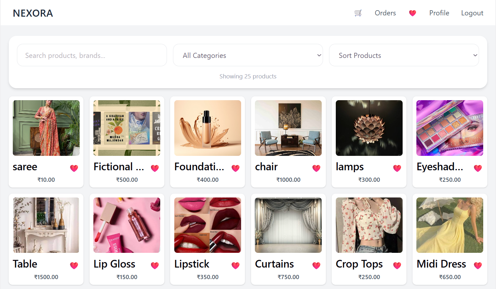
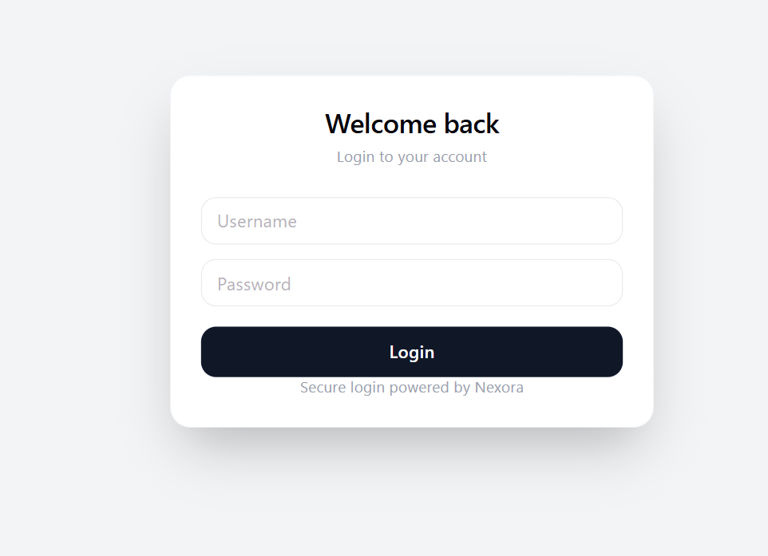
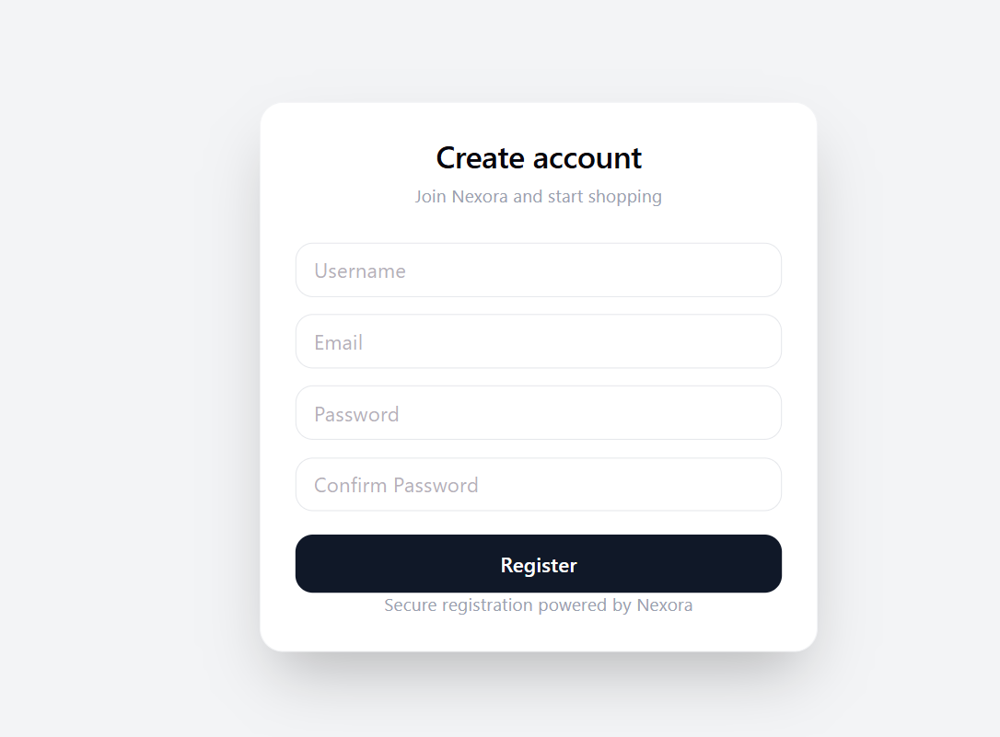
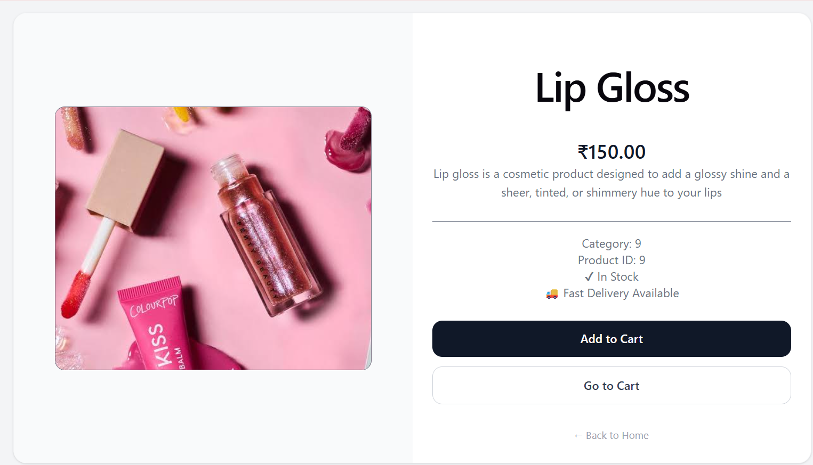
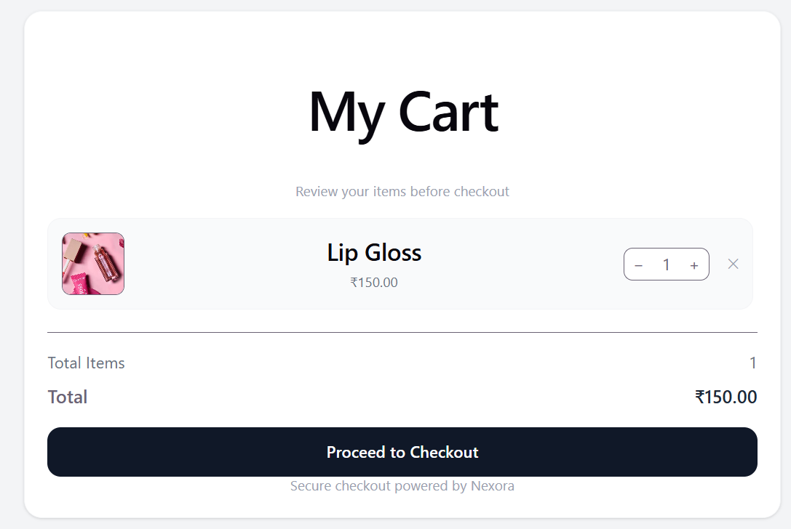
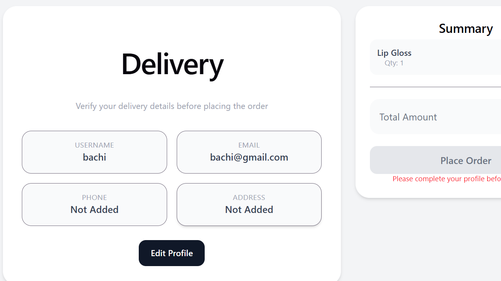
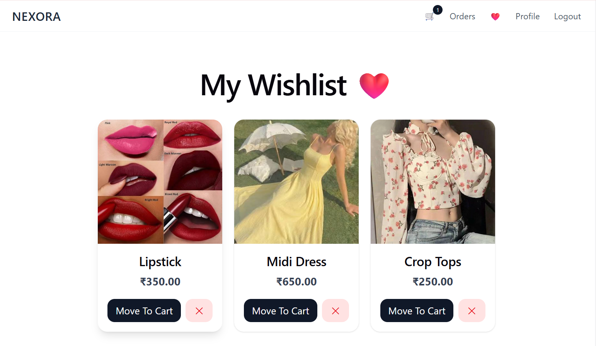
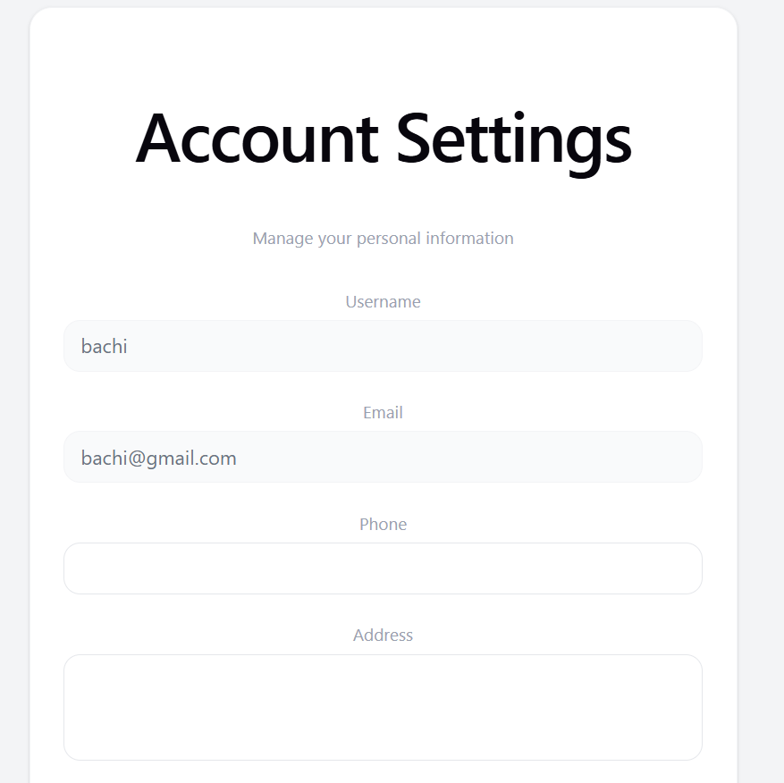
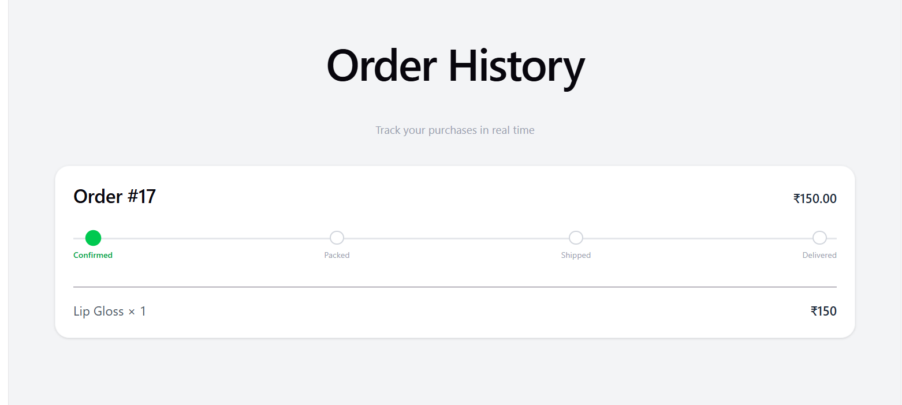

# 🛍️ Nexora

### ✨ A Modern E-Commerce Platform

A full-stack e-commerce web application built using **React**, **Django**, and **PostgreSQL**. Nexora provides a seamless shopping experience with user authentication, product browsing, wishlist management, cart functionality, order tracking, and profile management.

---

## 🚀 Tech Stack


---

# ✨ Features

### 👤 Authentication

* User Registration
* User Login
* Secure Authentication System

### 🛒 Shopping Features

* Browse Products
* View Product Details
* Add to Cart
* Remove from Cart
* Wishlist Management

### 📦 Order Management

* Delivery Details
* Order History Tracking

### 👤 User Profile

* View Profile Details
* Update User Information

### ⚙️ Backend Features

* Django REST Framework APIs
* PostgreSQL Database Integration
* Responsive User Interface

---

# 📸 Screenshots

## 🏠 Home Page



## 🔐 Login Page



## 📝 Register Page



## 📦 Product Details



## 🛒 Cart Details



## 🚚 Delivery Details



## ❤️ Wishlist



## 👤 Profile Details



## 📜 Order History



---

# 🛠️ Installation Guide

## 1️⃣ Clone Repository

```bash
git clone  https://github.com/AanchalJha05/Nexora.git
cd Nexora
```

## 2️⃣ Backend Setup

```bash
pip install -r requirements.txt
python manage.py migrate
python manage.py runserver
```

## 3️⃣ Frontend Setup

```bash
cd Store
npm install
npm start
```

## 4️⃣ Environment Variables

Create a `.env` file in the root directory:

```env
DB_NAME=your_db_name
DB_USER=your_db_user
DB_PASSWORD=your_db_password
DB_HOST=localhost
DB_PORT=5432
```

---

# 📂 Project Structure

```text
Nexora/
│
├── Store/               # React Frontend
├── Nexora/              # Django Project
├── media/               # Uploaded Media Files
├── screenshots/         # Project Screenshots
├── .env
├── .gitignore
├── requirements.txt
├── manage.py
└── README.md
```

---

# 🔮 Future Improvements

* 💳 Online Payment Integration
* ⭐ Product Reviews & Ratings
* 🔍 Advanced Product Search
* 📧 Email Verification
* 📊 Admin Dashboard Enhancements

---

# 👩‍💻 Author

**Aanchal**

Backend Development | Django | React | PostgreSQL | DSA

Building real-world projects and continuously improving backend development skills 

